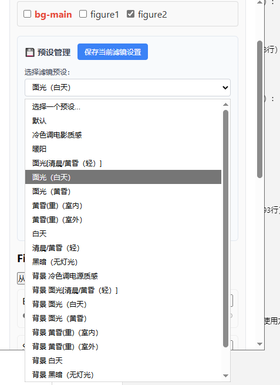

# WebGAL Transform Editor

🎥 基于 [Tauri](https://tauri.app) + [React](https://react.dev) + [TypeScript](https://www.typescriptlang.org/) 开发的 WebGAL 运镜脚本编辑器。  
支持可视化设置立绘位置、缩放、旋转（弧度），并导出 `setTransform` 与 `changeFigure` 指令！

---

## ✨ 功能特色

### 🎯 核心编辑功能
- ✅ 支持解析与编辑 `setTransform` 脚本（位置、缩放、旋转）
- ✅ 支持 `changeFigure` 指令编辑与导出（motion / expression / id / transform）
- ✅ 增量合并：`setTransform` 命令支持继承上一句的属性值
- ✅ 实时导出 WebGAL 脚本片段

### 🖱️ 交互操作
- ✅ **鼠标拖拽**：自由移动模型位置
- ✅ **缩放**：`Ctrl + 鼠标滚轮` 缩放模型
- ✅ **旋转**：`Alt + 鼠标拖拽` 旋转模型，体验类似 Photoshop 旋转控件
- ✅ **多选**：`Shift + 点击` 选中多个模型
- ✅ **全选/取消全选**：使用工具栏按钮快速选择所有模型

### 🎮 WebGAL 模式
- ✅ 连接 WebGAL 游戏文件夹，自动识别 `figure` 和 `background` 目录
- ✅ 可视化选择立绘和背景文件
- ✅ 一键加载游戏资源，无需手动复制文件路径
- ✅ 支持 Live2D 模型（`.json` 和 `.jsonl` 格式）

### 👁️ 观测层功能
- ✅ **颜色层**：在场景上覆盖一层中性灰，混合模式为颜色，用于观测明度。
- ✅ **明度层**：在场景上覆盖一层中性灰，混合模式为明度，用于观测颜色。
- ⚠️ **注意**：开启观测层时，画布会阻止交互，无法拖拽或旋转模型（用于纯粹查看效果）

### 📏 辅助线功能
- ✅ **无辅助线**：关闭辅助线显示
- ✅ **三分法**：显示三分法构图辅助线
- ✅ **中心十字**：显示中心十字辅助线
- ✅ **对角线**：显示对角线辅助线
- ✅ **黄金比例**：显示黄金比例辅助线

### 🎨 滤镜系统
- ✅ 丰富的内置滤镜预设（模糊、老电影、噪点、反射、RGB分离等）
- ✅ 自定义滤镜参数调整
- ✅ 支持保存和加载用户预设
- ✅ 可选择应用到所有模型或仅选中模型

---

## 🚀 快速开始

### 1. 克隆项目

```bash
git clone https://github.com/KonshinHaoshin/Webgal_transformEditor.git
cd Webgal_transformEditor
```

### 2. 安装依赖

本项目使用 npm 作为包管理器

```bash
npm install
```

### 3. 启动开发环境

```bash
npm run tauri dev
```

启动后自动打开桌面窗口，进行可视化脚本编辑。

---

## 📖 详细使用方法

### 🖱️ 基础操作

#### 移动模型
1. **单选移动**：直接点击并拖拽模型
2. **多选移动**：
   - 按住 `Shift` 键，依次点击需要选中的模型
   - 或者点击 "Select All" 按钮全选所有模型
   - 选中后拖拽任意一个模型，所有选中的模型会同步移动

#### 缩放模型
- 按住 `Ctrl` 键，然后滚动鼠标滚轮
- **向上滚动**：放大模型
- **向下滚动**：缩小模型
- 缩放会相对于鼠标位置进行，提供更精确的缩放体验

#### 旋转模型
- 按住 `Alt` 键，然后拖拽模型
- 旋转会围绕模型中心点进行
- 旋转角度以弧度为单位显示（后续会转换为度数的显示）

#### 选择操作
- **单选**：直接点击模型
- **多选**：按住 `Shift` 键，点击多个模型
- **全选**：点击工具栏的 "Select All" 按钮
- **取消全选**：点击工具栏的 "Deselect All" 按钮

### 🎮 WebGAL 模式使用

1. **启用 WebGAL 模式**：
   - 勾选界面上的 "WebGAL模式" 复选框
   - 在弹出的文件夹选择对话框中选择你的 WebGAL 游戏根目录

2. **加载资源**：
   - 在 WebGAL 模式下，可以方便地选择 `figure` 目录中的立绘文件
   - 支持普通图片格式（`.png`、`.jpg` 等）和 Live2D 模型（`.json`、`.jsonl`）
   - 选择背景文件时，会从 `background` 目录中加载

3. **Live2D 支持**：
   - 支持且只支持cubism2类型的live2d文件（常见的如你邦的live2d）
   - 支持社区中存在的compositeModel模型（jsonl聚合模型）
   - 加载后可以在画布上预览和编辑 Live2D 模型的变换
   - 支持 Live2D 模型的移动、缩放和旋转操作
   - 目前暂未实现显示live2d动作标签

4. **退出 WebGAL 模式**：
   - 取消勾选 "WebGAL模式" 复选框即可退出

> webgal模式示意图如上，其中左边的是由b站up主哈吉拉克上的岸古制作的号角soyo.jsonl，旁边的浴袍则是群u制作的浴袍海玲.json

### 👁️ 观测层功能使用

1. **开启观测层**：
   - 在顶部工具栏找到 "观察层" 下拉菜单
   - 选择 "颜色" 或 "明度" 模式

2. **查看效果**：
   - 场景会实时转换为对应的观测模式显示
   - 便于检查构图的色彩分布或明度层次

3. **注意事项**：
   - ⚠️ **开启观测层时，画布会阻止所有交互**（包括拖拽、旋转、缩放）
   - 这是设计特性，目的是让你专注于查看效果而不误操作

4. **关闭观测层**：
   - 在 "观察层" 下拉菜单中选择 "无" 即可恢复正常显示和交互


> 第一个是颜色模式的示意图，第二个是明度模式的示意图……
> 是的，颜色模式是用来观察明度的，明度模式是用来观察颜色的。至于为什么我要这么命名，只是因为中性灰这一层的混合模式罢了……


### 📏 辅助线功能使用

1. **选择辅助线类型**：
   - 在顶部工具栏找到 "辅助线" 下拉菜单
   - 选择需要的辅助线类型：
     - **无辅助线**：关闭辅助线
     - **三分法**：显示三分法构图线，适合突出主体
     - **中心十字**：显示中心十字线，适合对称构图
     - **对角线**：显示对角线，适合动态构图
     - **黄金比例**：显示黄金比例线，适合经典构图

2. **使用技巧**：
   - 辅助线会叠加显示在画布上，不会影响实际操作
   - 可以随时切换不同的辅助线类型来比较效果
   - 建议在最终确定位置前使用辅助线检查构图

### 🎨 滤镜功能使用

1. **应用滤镜预设**：
   - 勾选 "启用滤镜预设" 复选框
   - 在滤镜预设下拉菜单中选择预设
   - 点击 "应用到选中模型" 或 "应用到所有模型"
   - 后续可能会更新hsl模式

2. **自定义滤镜**：
   - 调整右侧滤镜面板中的各项参数
   - 参数会实时应用到画布上

3. **保存自定义预设**：
   - 调整好滤镜参数后，可以在滤镜面板中保存为自定义预设
   - 自定义预设会保存到浏览器本地存储中

4. **应用范围**：
   - **应用到选中模型**：仅将滤镜应用到当前选中的模型
   - **应用到所有模型**：将滤镜应用到画布上的所有模型（包括背景）

> 效果如下

> 为了方便大家使用，我制作了大量的滤镜预设

### 📝 脚本编辑

1. **解析脚本**：
   - 在左侧文本框中粘贴 WebGAL 脚本
   - 点击 "Load Script" 按钮，会自动打开输出脚本界面
   - 脚本会被解析并在画布上显示对应的模型和变换

2. **编辑脚本**：
   - 在输出脚本窗口中，可以直接编辑每一行脚本
   - **实时同步**：编辑脚本后，主窗口会实时更新显示效果
   - **添加/移除 `-next`**：点击每行左侧的 "N" 按钮可以添加或移除 `-next` 标记
   - **设置断点**：点击每行左侧的 "○" 按钮可以设置断点，用于调试动画播放
   - **删除行**：点击每行右侧的 "×" 按钮可以删除该行脚本
   - **复制脚本**：
     - 点击 "复制脚本" 按钮可以复制所有脚本
     - 点击 "只复制setTransform语句" 按钮可以只复制 `setTransform` 命令
   - **快捷键**：
     - `Enter`：提交编辑并应用更改
     - `Shift + Enter`：在脚本行中插入换行

3. **脚本导出**：
   - 脚本会自动实时导出到输出脚本窗口
   - 支持导出 `setTransform` 和 `changeFigure` 指令
   - 可以设置导出动画的持续时间（duration）和缓动函数（ease）
   - 支持增量合并：`setTransform` 命令会继承上一句的属性值

### 🎬 动画预览

1. **播放动画**：
   - 点击 "播放" 按钮可以预览脚本动画效果
   - 动画会按照脚本中的时间顺序播放
   - 播放过程中会显示动画的实时状态

2. **断点调试**：
   - 在输出脚本窗口中设置断点
   - 动画播放会在断点处暂停
   - 可以检查每个关键帧的效果

### 📐 画幅比设置

1. **选择画幅比**：
   - 在工具栏中选择不同的画幅比（16:9、21:9、1.85:1、16:10、4:3、自定义）
   - 画布宽度会根据选择的画幅比自动调整
   - 高度固定为 1440px
   - webgal的原生分辨率为2560x1440，关于如何更改webgal分辨率可以看我的教学视频

2. **自定义画幅比**：
   - 选择 "custom" 选项可以自定义画布宽度
   - 适合特殊尺寸需求的场景

---

## 🛠️ 构建与打包

### 系统要求

- **Node.js**: 16.x 或更高版本
- **Rust**: 1.70 或更高版本（用于 Tauri 构建）
- **系统依赖**：
  - **Windows**: 需要安装 [Microsoft Visual C++ Redistributable](https://aka.ms/vs/17/release/vc_redist.x64.exe)
  - **macOS**: 需要安装 Xcode Command Line Tools
  - **Linux**: 需要安装系统依赖（详见 [Tauri 文档](https://tauri.app/v1/guides/getting-started/prerequisites)）

### 开发模式

```bash
npm run tauri dev
```

这会启动开发服务器，自动打开桌面应用窗口。

### 构建生产版本

```bash
npm run tauri build
```


### 打包选项

- **Windows**: 生成 `.msi` 安装包
- **macOS**: 生成 `.dmg` 或 `.app` 文件
- **Linux**: 生成 `.deb`、`.rpm` 或 `.AppImage` 文件

---

## 📋 技术栈

- **[Tauri](https://tauri.app)** - 桌面应用框架
- **[React](https://react.dev)** - UI 框架
- **[TypeScript](https://www.typescriptlang.org/)** - 类型系统
- **[PixiJS](https://pixijs.com/)** - 2D 渲染引擎
- **[Live2D](https://www.live2d.com/)** - 支持 Live2D 模型显示

---

## 📝 支持的脚本格式

### setTransform 指令

```javascript
setTransform figure1 -duration=500 -x=100 -y=200 -scaleX=1.5 -scaleY=1.5 -rotation=0.5;
```

### changeFigure 指令

```javascript
changeFigure figure1 -motion=idle -expression=happy -id=character1 -duration=0;
```

### 支持的参数

- `position`: 位置（x, y）
- `scale`: 缩放（scaleX, scaleY）
- `rotation`: 旋转（弧度）
- `duration`: 动画持续时间（毫秒）
- `ease`: 缓动函数（easeIn, easeOut, easeInOut 等）
- `-next`: 标记是否等待用户点击继续

---

## 📄 许可证

查看 [LICENSE](LICENSE) 文件了解详情。

---

## 🤝 贡献

欢迎提交 Issue 和 Pull Request！

---

**Happy Editing! 🎉**
